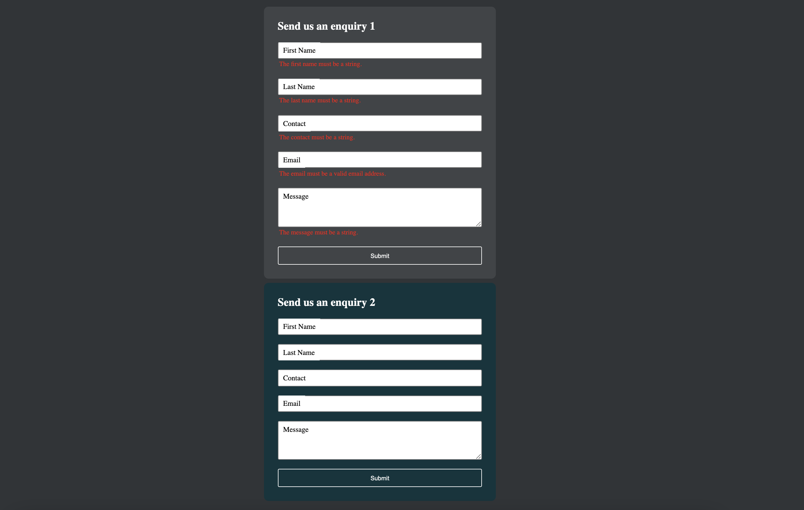

## Vanilla javascript library of Hapi Form

```npm
npm i hapiform.js or yarn add hapiform.js
``` 

> Create hapi form from [here](https://hapiform.sg)


> Add reference of [hapiform.css](https://unpkg.com/hapiform.js@latest/hapiform.css) & [hapiform.js](https://unpkg.com/hapiform.js@latest/hapiform.js) unpkg cdn.

```html
<!--unpkg cdn-->

<link rel="stylesheet" href="https://unpkg.com/hapiform.js@latest/hapiform.css">

<script src="https://unpkg.com/hapiform.js@latest/hapiform.js" defer></script>
```

```javascript

<!-- ... 
 css & hapiform.js referenced
-->


<script>
  /**
  * Array of parameters/config of HapiForm
  * @param hapiFormID - required - form id, like: '40552337-abcd-abcd-abcd-e4bc28e9c874'
  * @param formSelector? - optional - selector of Form Element. default: '#hapi-form'
  * @param redirectUrl? - optional - redirect to page, default: '/thank-you.html'
  * @param i18nLocale? - optional - i18n locale code
  */
  new HapiForm(
    [  
      {
        hapiFormID: '40552337-abcd-abcd-abcd-e4bc28e9c874', // todo: replace your real form Id
        redirectUrl:'/thank-you.html'
      }
    ]
  );
</script>

```

> Multiple forms in one page:

```javascript

/*
* using `formSelector` for multiple forms in one page.
* */

 <!-- ... 
  css & hapiform.js referenced
 -->

<script>
  /* form 1 */
  new HapiForm(
    [
      /* params of form 1 */
      {
        formSelector: '#hapi-form-1',
        hapiFormID: '40552337-aaaa-aaaa-aaaa-e4bc28e9c874', // todo: replace your real form Id
        redirectUrl: '/thank-you.html',
      },
      /* params of form 2 */
      {
        formSelector: '#hapi-form-2',
        hapiFormID: '40552337-bbbb-bbbb-bbbb-e4bc28e9c874', // todo: replace your real form Id
        redirectUrl: '/thank-you.html',
      },
    ],
  ); 
</script>

```

> Demo - Download the source code and open `index.html` you will see 2 forms as bellow:




